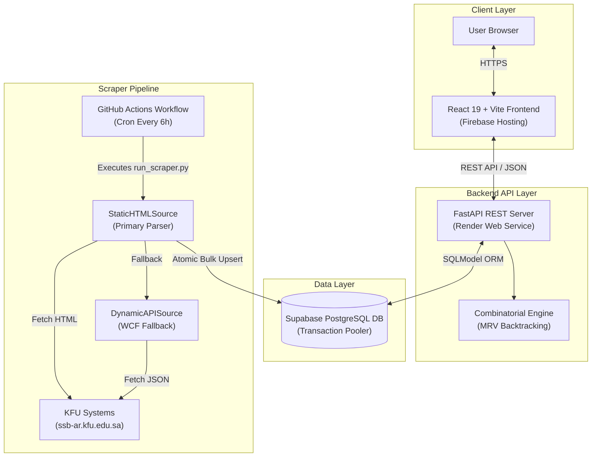

# KFU Scheduler (جدولني - جامعة الملك فيصل)

<div align="center">

[](https://kfu-scheduler.web.app)
[](https://kfu-schedular-api.onrender.com)
[](https://supabase.com)
[](https://github.com/xhadi/kfu-schedular/actions/workflows/scraper.yml)
[](LICENSE)

An intelligent, full-stack schedule generation platform designed for King Faisal University (KFU) students. Instantly computes all non-conflicting timetable options from official university course offerings using recursive backtracking algorithms and real-time client-side filters.

[**Launch Web App**](https://kfu-scheduler.web.app) • [**API Health Check**](https://kfu-schedular-api.onrender.com) • [**Backend README**](./backend/Readme.md) • [**Frontend README**](./frontend/Readme.md)

</div>

---

## Service & System Status

| Component | Hosting / Service Provider | System Status | Endpoint / Reference |
|---|---|---|---|
| **Web Frontend** | **Firebase Hosting** | 🟢 **Online (Live)** | [kfu-scheduler.web.app](https://kfu-scheduler.web.app) |
| **REST API Server** | **Render Web Service** | 🟢 **Running (Healthy)** | [kfu-schedular-api.onrender.com](https://kfu-schedular-api.onrender.com) |
| **Database Engine** | **Supabase PostgreSQL** | 🟢 **Active (Connected)** | Port `6543` (Transaction Pooler) |
| **Scraper Automation** | **GitHub Actions** | 🟢 **Scheduled** | Every 6 Hours (`0 */6 * * *`) |

---

## Architecture Overview



---

## Core Features

- **Combinatorial Schedule Generator**: Computes all valid non-conflicting schedule combinations using recursive backtracking with the **Minimum Remaining Values (MRV)** heuristic.
- **Automatic College Section Linking**: Auto-pairs theory sections with lab/practical sections via college offset rules (e.g. CCSIT and Agricultural Sciences).
- **Advanced Client-Side Filters**: Instant, zero-latency filtering by day-off preferences, preferred instructors, CRN search, and section availability.
- **Dual-Strategy Scraper Pipeline**: High-resilience catalog scraper featuring a primary **Static HTML parser** and fallback **Dynamic WCF API client** with rate-limited Telegram alert reporting.
- **Multi-Platform Support**: Built and tested to run seamlessly on **Windows, macOS, Linux, and WSL**.
- **Modern Responsive UI**: Built with React 19, Tailwind CSS v4, dark mode support, and an Arabic RTL interface.

---

## Repository Structure

```
kfu-scheduler/
├── backend/                  # FastAPI + SQLModel Python Backend
│   ├── main.py               # REST API entry point
│   ├── database.py           # SQLModel engine & session management
│   ├── models.py             # Database ORM models
│   ├── run_scraper.py        # CLI entry point for course catalog scraper
│   ├── routers/              # API Route handlers (colleges, schedules, scraping)
│   ├── scraper/              # Scraper pipeline, sources & DB sync logic
│   └── tests/                # Pytest test suite (28 passing tests)
│
├── frontend/                 # React 19 + Vite Frontend
│   ├── src/
│   │   ├── api/              # API client functions
│   │   ├── components/       # UI components (Step 1 Selection & Step 2 Results)
│   │   ├── contexts/         # State contexts (ScheduleContext, ThemeContext, UiTextContext)
│   │   └── hooks/            # Custom hooks (useCourseCatalog, useScrapeStatus)
│   └── index.html            # Vite HTML template & theme flash prevention
│
├── .github/
│   └── workflows/
│       └── scraper.yml       # 6-hour automated catalog scraper workflow
│
└── README.md                 # Project root documentation
```

---

## Local Development Guide

### Prerequisites
- **Python 3.12+**
- **Node.js 18+** and `npm`

### 1. Start the Backend API (Terminal 1)

```bash
# Navigate to backend directory
cd backend

# Create and activate virtual environment
python -m venv .venv
# Windows (CMD / PowerShell):
.venv\Scripts\activate
# macOS / Linux / WSL:
source .venv/bin/activate

# Install dependencies
pip install -r requirements.txt

# Create environment configuration
cp .env.example .env

# Run FastAPI dev server (port 8000)
uvicorn main:app --reload
```

### 2. Start the Frontend Dev Server (Terminal 2)

```bash
# Navigate to frontend directory
cd frontend

# Install dependencies
npm install

# Run Vite dev server (port 5173, proxies /api to localhost:8000)
npm run dev
```

Open [http://localhost:5173](http://localhost:5173) in your browser.

---

## Testing & Verification

### Running Backend Unit Tests

```bash
cd backend
python -m pytest tests/ -v
```

### Running Frontend Linter & Production Build

```bash
cd frontend
npm run lint
npm run build
```

---

## Deployment & Production Architecture

* **Frontend**: Hosted on [Firebase Hosting](https://firebase.google.com/docs/hosting) (`kfu-scheduler.web.app`).
* **Backend Web Service**: Deployed on [Render](https://render.com) (`kfu-schedular-api.onrender.com`).
* **PostgreSQL Database**: Deployed on [Supabase](https://supabase.com) using Transaction Mode (`port 6543`).
* **Automated Scraper Cron**: Managed via [GitHub Actions](https://github.com/features/actions) (`.github/workflows/scraper.yml`) running every 6 hours.

---

## License & Credits

Developed by **Hadi** for King Faisal University students.
Distributed under the MIT License.
